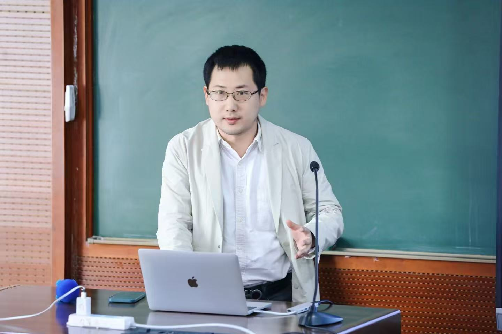
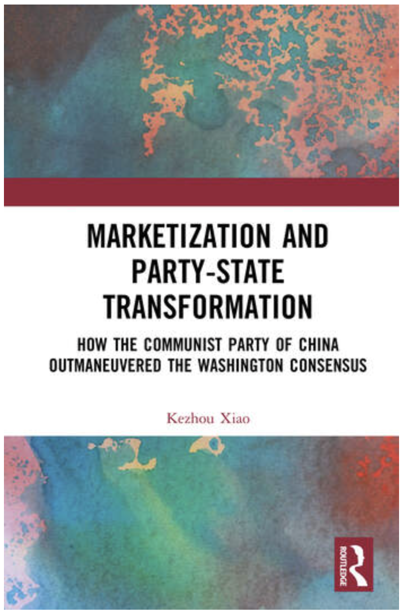

::: {.hero}

::: {.hero-text}
[Research Assistant Professor, Institute of Guangdong, Hong Kong, Macau Development Studies, Sun Yat-sen University, Guangzhou, China.]{.identity}

[[University Page](https://ygafz.sysu.edu.cn/teacher/2027) · [Google Scholar](https://scholar.google.com/citations?user=KCiDSJQAAAAJ&hl=en) · [Email](mailto:spencerxiao@gmail.com)]{.links}
:::
:::

My research mainly examines the political economy of China's reform and development, focusing on state-business relations, cadre policy, and party-state transformation.

## Education

- Ph.D. in Economics, London School of Economics and Political Science, 2015–2021 — *LSE School Scholarship* (Supervisors: Philippe Aghion and Tim Besley)
- M.Sc. in Econometrics and Mathematical Economics (with Distinction), London School of Economics and Political Science, 2012–2014 — *Ely Devons Prize for Best Performance*
- M.S. in Statistics, University of Virginia, 2012
- B.A. in Mathematics and Economics (with Distinction), University of Virginia, 2009–2011

## Book Project

{.book-cover}

[Marketization and Party-State Transformation: How the Communist Party of China Outmaneuvered the Washington Consensus]{.book-title}
[London: Routledge, 2026 — [Available now](https://www.routledge.com/Marketization-and-Party-State-Transformation-How-the-Communist-Party-of-China-Outmaneuvered-the-Washington-Consensus/Xiao/p/book/9781041413196)]{.book-status}

When the Berlin Wall fell in 1989, China's Communist Party faced terminal crisis — yet it averted collapse and engineered history's most dramatic economic ascent by rejecting Washington's prescriptions for liberal democratic transition and transforming the party-state into a Socialist Developmental State.

Formalizing the political logic of China's marketization through a political economy model of endogenous talent allocation, the book demonstrates that the core instrument of the party-state's transformation was not industrial policy but cadre policy. The strategic management of officials, shaped by leadership dynamics at the apex of the party, created the institutional impetus that drove China's Socialist Big Push. Furthermore, the proposed framework contributes to the understanding of China's post-2012 trajectory under Xi Jinping in relation to China's growth momentum and political dynamics.

The book will appeal to scholars and students of comparative political economy, economic development, and Chinese politics, as well as policymakers with a focus on Sino-US competition in the age of AI.

[Read more →](book-project.qmd)

Related papers:

[From Revolutionaries to Technocrats: How Four Modernizations of Cadres Drove China's Market Transition]{.paper-title}
[Under Review]{.journal-line}

[Defying the Washington Consensus: the Socialist Big Push and the Making of China's Developmental State]{.paper-title}
[Submitted]{.journal-line}

Presentations (8)

Sun Yat-sen University (2022/12) · Nanjing University (2023/5) · South China Normal University (2023/6) · Fudan University (2023/10) · Xiamen University (2023/11) · International Economic Association World Congress in Colombia (2023/12) · Shanghai Jiaotong University (2026/4) · International Economic Association World Congress in Serbia (2026/6)

## Working Papers

[[Stimulus versus Market: How China's 2008 Rescue Package Polarized Firm Dynamics and Altered Privatization](https://papers.ssrn.com/sol3/papers.cfm?abstract_id=6913454)]{.paper-title} (with Liuqin Zhang and Yasheng Zhang)
[Under Review]{.journal-line}

Presentations (5)

Sun Yat-sen University (2024/4) · YES Meeting at Northwest University, Xi'an, China (2024/5) · CCER Summer Institute (2024/6) · CES Meeting at Zhejiang University (2024/7) · CUHK Shenzhen (2026/7)

[Does Internationalizing the Stock Market Stimulate ESG Performance? Evidence from Connect Programs]{.paper-title} (with Shupeng Lin, Li Chen, and Luofu Ye)
[Under Review]{.journal-line}

Presentations (3)

YES Meeting at Jinan University (2024/11) · China Society of World Economics (2024/11) · Tsinghua University (2025/4)

## Publications

[[Regularized National Congresses and Political Business Cycle: Institutionalized Economic Volatility in China](https://doi.org/10.1016/j.ecosys.2026.101396)]{.paper-title} (with Yulong Liu)
[*Economic Systems*, Online First (2026)]{.journal-line}

[[Becoming global billionaires from mainland China: 2004–2018](https://doi.org/10.1007/s11187-023-00782-2)]{.paper-title}
[*Small Business Economics* 62.2 (2024): 753-773]{.journal-line}

[[Serving the People or the People's Note: On the Political Economy of Talent Allocation](https://doi.org/10.1017/bap.2023.11)]{.paper-title}
[*Business and Politics* 25.3 (2023): 330-351]{.journal-line}

[[Fiscal Underpinnings for Sustainable Development in China: Rebalancing in Guangdong](https://doi.org/10.1007/978-981-10-6286-5)]{.paper-title} (edited with Ehtisham Ahmad and Meili Niu)
[Singapore: Springer, 2018]{.journal-line}

[[Distortion and Credibility within China's Internal Information System](https://doi.org/10.1080/10670564.2013.861155)]{.paper-title} (with Brantly Womack)
[*Journal of Contemporary China* 23.88 (2014): 680-697]{.journal-line}
